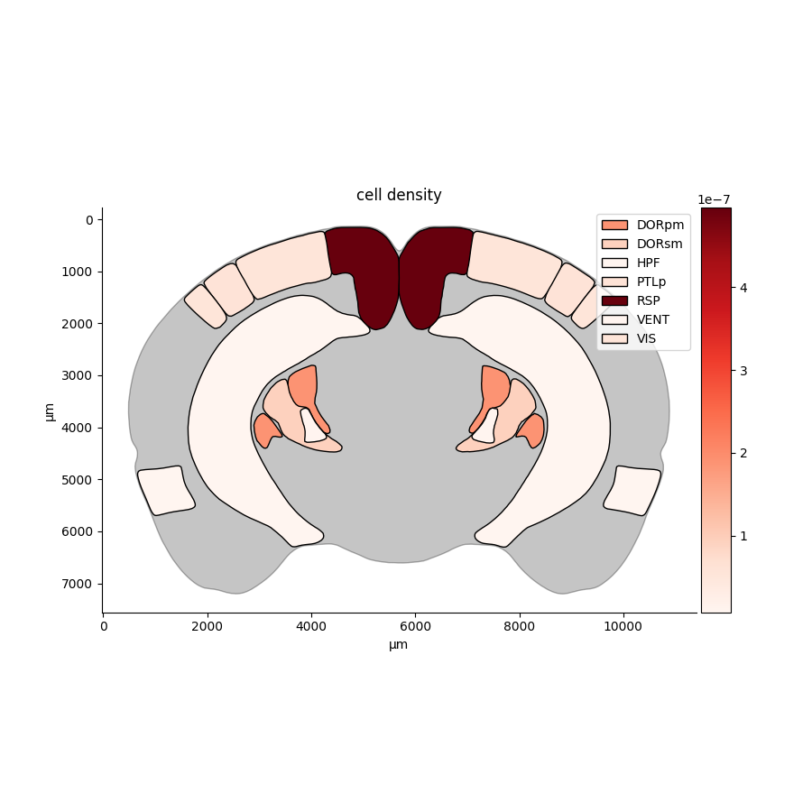
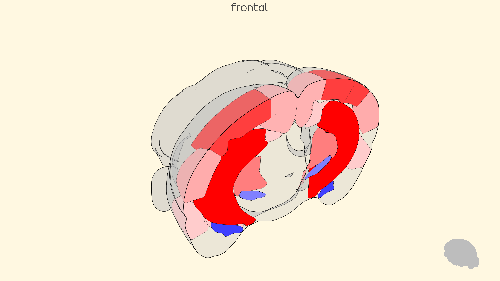
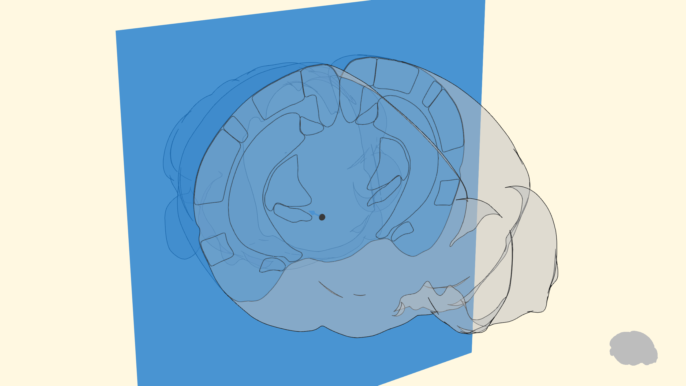
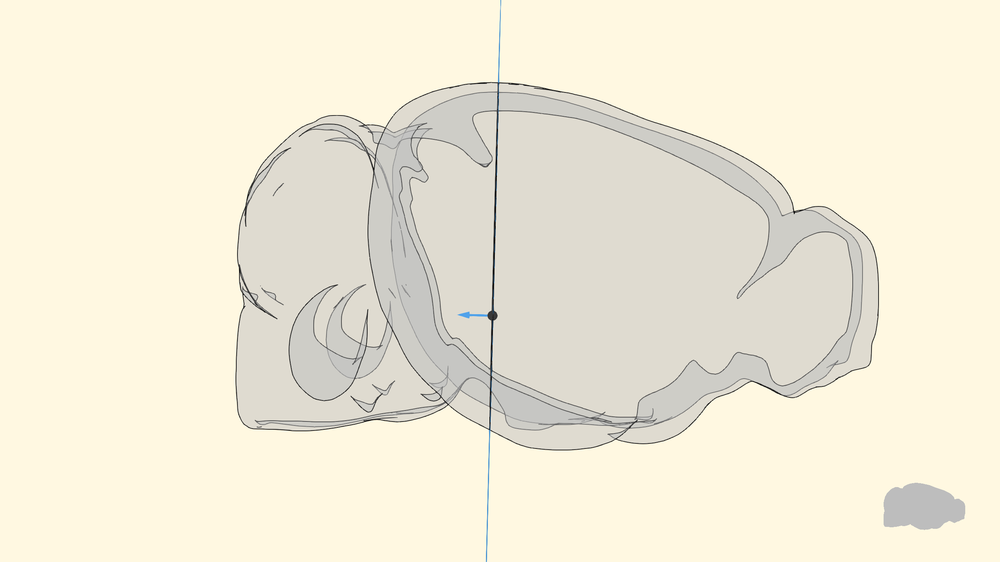
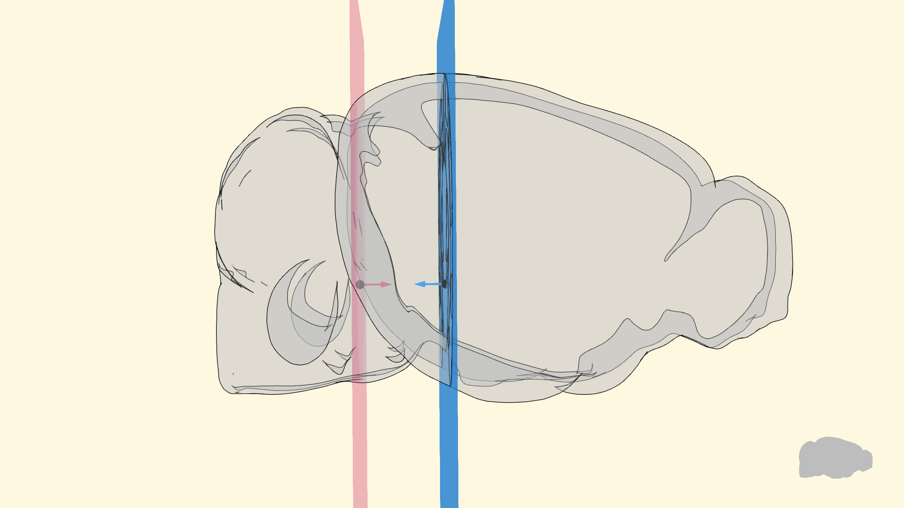

# brainglobe-heatmap
`brainglobe-heatmap` allows you to create heatmaps, mapping scalar values for each brain region (e.g., number of labelled cells in each region) to a color and creating beautiful visualizations in 2D (using [matplotlib](https://matplotlib.org/) or 3D (using [brainrender](https://brainglobe.info/documentation/brainrender/index.html)).



**2D heatmap generated using matplotlib**



**3D heatmap generated using brainrender**

## Installation
`pip install brainglobe-heatmap`


## User guide
The starting point for a heatmap visualization is a `dict` assigning scalar values to a set of brain regions (identified by their acronym).
For example:

```python
    regions = dict(  # scalar values for each region
        TH=1,
        RSP=0.2,
        AI=0.4,
        SS=-3,
        MO=2.6,
        ...
    )
```

`brainglobe-heatmap` creates a brainrender 3D `Scene` with the given regions colored according the values in the dictionary.
Next, to create visualizations like the ones shown above, the three dimensional scene needs to be **sliced** to expose
the relevant parts.
This is done by specifying the position and orientation of a `Plane` which cuts through the scene.



The orientation is set by the direction of a *normal vector* specified by the user.



Everything that is on the side opposite where the normal vector will be cut and discarded.
To keep a section of the 3D brain, two planes with normal vectors facing in opposite directions are used:



and everything in-between the two planes is kept as a slice.

### Slicing plane position
Finding the right position and orientation to the plane can take some tweaking. `brainglobe-heatmap` provides a `planner` class that makes the process easier by showing the position of the planes and how they intersect with the user provided regions (see image above).
In `examples/plan.py` there's an example showing how to use the `planner`:

```python
import brainglobe_heatmap as bgh


planner = bgh.plan(
    regions,
    position=(
        8000,
        5000,
        5000,
    ),
    orientation="frontal",  # orientation, or 'sagittal', or 'horizontal' or a tuple (x,y,z)
    thickness=2000,  # thickness of the slices used for rendering (in microns)
)
```

The position of the center of the plane is given by a set of `(x, y, z)` coordinates. The orientation can be specified by a string (`frontal`, `sagittal`, `horizontal`) which will result in a standard orthogonal slice, or by a vector `(x, y, z)` with the orientation along the 3 axes.

Whe using one of the named orientation, you don't need to pass a whole set of `(x, y, z)` coordinates for the plane center. A single value is sufficient as the other two won't affect the plane position:

```python
f = bgh.heatmap(
    values,
    position=1000,
    orientation="sagittal",  # 'frontal' or 'sagittal', or 'horizontal' or a tuple (x,y,z)
    thickness=1000,
    atlas_name="allen_cord_20um",
    format='2D',
).show()

```

Also, you can create a slice with a plane centered in the brain by passing `position=None`:
```python
f = bgh.heatmap(
    values,
    position=None,
    orientation="sagittal",  # 'frontal' or 'sagittal', or 'horizontal' or a tuple (x,y,z)
    thickness=1000,
    atlas_name="mpin_zfish_1um",
    format='2D',
    title='zebra fish heatmap'
).show(xlabel='AP (μm)', ylabel='DV (μm)')
```

### Visualization
Once happy with the position of the slicing planes, creating a visualization is as simple as:

```python

bgh.heatmap(
    values,
    position=(
        8000,
        5000,
        5000,
    ),
    orientation="horizontal",  # 'frontal' or 'sagittal', or 'horizontal' or a tuple (x,y,z)
    title="horizontal view",
    vmin=-5,
    vmax=3,
    cmap='Red',
    format="2D",
).show()
```

Here, `format` specifies if a 2D plot should be made (using `matplotlib`) or a 3D rendering instead (using `brainrender`). The `cmap` parameter specifies the colormap used and `vmin, vmax` the color range.

### Regions coordinates
You can use `brainglobe-heatmap` to get the coordinates of the 2D 'slices' (in the 2D plane's coordinates system):


```python

regions = ['TH', 'RSP', 'AI', 'SS', 'MO', 'PVZ', 'LZ', 'VIS', 'AUD', 'RHP', 'STR', 'CB', 'FRP', 'HIP', 'PA']


coordinates = bgh.get_plane_coordinates(
    regions,
    position=(
        8000,
        5000,
        5000,
    ),
    orientation="frontal",  # 'frontal' or 'sagittal', or 'horizontal' or a tuple (x,y,z)
)
```

## Using `brainglobe-heatmap` with other atlases.

`brainglobe-heatmap` uses `brainrender` which, in turn, uses brainglobe's `Atlas API` under the hood. That means that all of `brainglobe-heatmap`'s functionality is compatible with any of the atlases supported by the atlas API. `bgh.heatmap`, `bgh.planner` and `bgh.get_plane_coordinates` all accept a `atlas_name` argument, pass the name of the atlas name you'd like to use!
For more information see the API's [documentation](https://brainglobe.info/documentation/bg-atlasapi/index.html).

## Contributing
Contributions to `brainglobe-heatmap` are more than welcome. Please see the [Developer's guide](https://github.com/brainglobe/.github/blob/main/CONTRIBUTING.md).

## Citing `brainglobe-heatmap`
If you use `brainglobe-heatmap` in your work, please cite it as:

```
Federico Claudi, & Luigi Petrucco. (2022). brainglobe/bg-heatmaps: (V0.2). Zenodo. https://doi.org/10.5281/zenodo.5891814
```

`brainglobe-heatmap` was originally developed by Federico Claudi and Luigi Petrucco, with the help of Marco Musy (the developer of [`vedo`](https://github.com/marcomusy/vedo))
